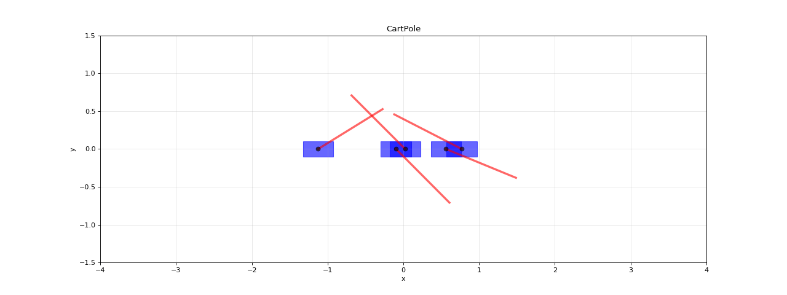
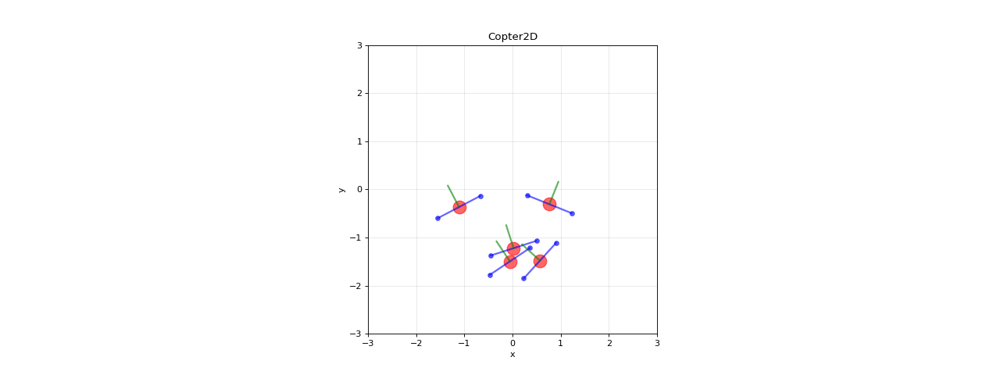

# PPO From Scratch

A JAX/Flax implementation of Proximal Policy Optimization (PPO) with multiple distribution types and a new Simple Policy Optimization (SPO) loss function.

## Overview

This project implements PPO from scratch using JAX for high-performance vectorized environments. The implementation features:

- Multiple probability distributions for continuous action spaces
- Standard PPO with clipped surrogate objective
- **Simple Policy Optimization (SPO)** - a new variant
- Vectorized environments for efficient training
- Support for different network architectures

## Examples (Trained in 15sec 50M timesteps, Nvidia 3060 laptop GPU)
### CartPole Environment Animation


### Copter2D Environment Animation



## Mathematical Foundation

### PPO Objective

The standard PPO loss function uses a clipped surrogate objective:

```
L_CLIP(θ) = Ê[min(r_t(θ)Â_t, clip(r_t(θ), 1-ε, 1+ε)Â_t)]
```

Where:
- `r_t(θ) = π_θ(a_t|s_t) / π_θ_old(a_t|s_t)` is the probability ratio
- `Â_t` is the advantage estimate
- `ε` is the clipping parameter (typically 0.2)

### Simple Policy Optimization (SPO)

This implementation introduces a **Simple Policy Optimization** loss function that provides an alternative to the standard clipped objective:

```
L_SPO(θ) = Ê[r_t(θ)Â_t - |Â_t| · (r_t(θ) - 1)² / (2ε)]
```

**Key advantages of SPO:**
- **Smoother gradients**: Unlike PPO's hard clipping, SPO uses a quadratic penalty
- **Automatic regularization**: The second term naturally prevents large policy updates
- **Interpretable**: The penalty term `|Â_t| · (r_t(θ) - 1)² / (2ε)` directly penalizes deviations from the old policy proportional to advantage magnitude

**Mathematical intuition:**
- When `r_t(θ) ≈ 1` (similar to old policy): penalty ≈ 0, allowing updates
- When `r_t(θ)` deviates significantly: penalty grows quadratically
- Larger advantages `|Â_t|` create stronger constraints, preventing destructive updates on important transitions

### Value Function and Advantage Estimation

The value function loss uses clipped updates:

```
L^VF = (V_θ(s_t) - V_t^targ)²
```

With clipped value predictions:
```
V_clipped = V_old + clip(V_θ(s_t) - V_old, -ε_v, ε_v)
L^VF = max((V_θ(s_t) - V_t^targ)², (V_clipped - V_t^targ)²)
```

Advantages are computed using Generalized Advantage Estimation (GAE):

```
δ_t = r_t + γV(s_{t+1}) - V(s_t)
A_t = Σ_{l=0}^∞ (γλ)^l δ_{t+l}
```

## Network Architecture

### ActorCritic Network

```python
class ActorCritic(nn.Module):
    action_dim: int
    
    def __call__(self, x):
        # Shared feature extraction
        actor = nn.tanh(nn.Dense(32)(x))
        actor = nn.tanh(nn.Dense(32)(actor))
        
        # Policy head
        mean = nn.Dense(action_dim)(actor)
        log_std = self.param("log_std", constant_init, (action_dim,))
        
        # Value head  
        critic = nn.tanh(nn.Dense(32)(x))
        critic = nn.tanh(nn.Dense(32)(critic))
        critic = nn.Dense(1)(critic)
        
        return distribution, value
```

**Architecture features:**
- **Separate networks**: Actor and critic have independent hidden layers
- **Orthogonal initialization**: Uses orthogonal weight initialization for stable training
- **State-independent std**: Log standard deviation is a learnable parameter, not state-dependent

## Probability Distributions

### 1. Multivariate Normal Distribution

Standard Gaussian distribution for continuous actions:

```
π(a|s) = N(μ(s), Σ)
log π(a|s) = -½[(a-μ)ᵀΣ⁻¹(a-μ) + log|2πΣ|]
```

### 2. Tanh-Transformed Normal Distribution

For bounded action spaces [-1, 1]:

```
a = tanh(z), where z ~ N(μ, σ²)
log π(a|s) = log π_z(arctanh(a)) - Σ log(1 - a²)
```

**Entropy estimation**: Uses Monte Carlo with optimized sample points for fast computation.

### 3. Truncated Normal Distribution

Direct truncation to [-1, 1] bounds:

```
π(a|s) = N(μ, σ²) / ∫_{-1}^{1} N(x; μ, σ²)dx
```

Sampling via inverse CDF method:
```
u ~ Uniform[0,1]
CDF = Φ((x-μ)/σ)
a = Φ⁻¹(Φ(-1) + u(Φ(1) - Φ(-1)))
```

### 4. Beta Distribution

Alternative for bounded actions with natural [0,1] support:

```
π(a|s) = Beta(α(s), β(s))
log π(a|s) = (α-1)log(a) + (β-1)log(1-a) - B(α,β)
```

## Training Configuration

### Hyperparameters

| Parameter | Description | Default |
|-----------|-------------|---------|
| `LR` | Learning rate | 3e-4 |
| `NUM_AGENTS` | Parallel environments | 1024 |
| `NUM_STEPS` | Steps per rollout | 128 |
| `EPOCHS` | PPO epochs per update | 4 |
| `NUM_MINIBATCHES` | Minibatches per epoch | 4 |
| `GAMMA` | Discount factor | 0.99 |
| `GAE_LAMBDA` | GAE parameter | 0.95 |
| `CLIP_EPS` | PPO clipping parameter | 0.2 |
| `ENT_COEF` | Entropy coefficient | 0.01 |
| `VF_COEF` | Value function coefficient | 0.5 |


## Usage

### Training

```python
# Initialize environment and parameters
env = CartPoleEnv()
env_params = env.make_params(num_agents=1024, num_steps=100)

# Configure PPO parameters
ppo_params = ppo.make_params(
    LR=3e-4,
    TOTAL_TIMESTEPS=100_000_000,
    NUM_AGENTS=1024,
    NUM_STEPS=100,
    EPOCHS=4,
    ENT_COEF=0.05
)

# Create and train
network = ActorCritic(action_dim=env.action_space(env_params)[0].shape[0])
train_fn = jax.jit(ppo.make_train(network, env, env_params, ppo_params))
result = train_fn(jax.random.PRNGKey(0))
```

## Key Features

### Performance Optimizations

- **JAX JIT compilation**: All training loops are JIT-compiled for speed
- **Vectorized environments**: Efficient parallel environment execution
- **Scan operations**: Use `jax.lax.scan` for efficient sequential operations

### Debugging and Monitoring

- **Real-time metrics**: Episode rewards, losses, and entropy tracking
- **Colored output**: Clear visual feedback during training


## Future Extensions

- [x] Privileged learning support for asymmetric actor-critic
- [ ] Additional distribution types (e.g., mixture models)
- [ ] Adaptive clipping parameters
- [ ] Reward Constrained Policy Optimization (RCPO) integration
- [ ] Crazyflie drone control example
- [ ] Equivariant Reinforcement Learning for Quadrotor UAV 

## References
- [PPO Paper](https://arxiv.org/abs/1707.06347)
- [SPO Paper](https://arxiv.org/abs/2401.16025)
- [JAX Documentation](https://jax.readthedocs.io/en/latest/)
- [purejaxrl](https://github.com/ChaitanyaKatti/fast-RL-jax)